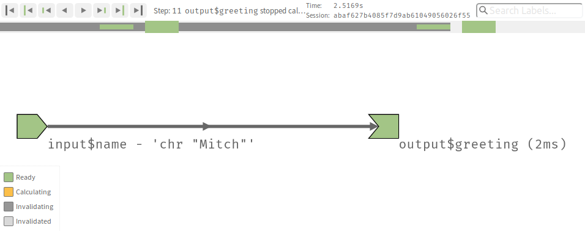

class: inverse
background-image: url("images/title.jpg")
background-size: cover

```{r setup, include=FALSE}
options(htmltools.dir.version = FALSE, width = 120)

library(tidyverse)
library(shiny)
library(fontawesome)
library(countdown)

theme_set(
  theme_grey(base_size = 16) +
  theme(
    legend.position = "bottom",
    plot.background = element_rect(fill = "transparent"),
    legend.background = element_rect(fill = "transparent")
  )
)
```


```{css, echo=FALSE}
/* custom.css */
.left-code {
  color: #777;
  width: 40%;
  height: 92%;
  float: left;
}
.right-plot {
  width: 58%;
  float: right;
  padding-left: 1%;
}
```

<ul class="hextile clr">
	<li>
    <div>
      <h1>02</h1>
      <p style = "padding-top: 30%; font-size: 1.2em">Reactive programming</p>
    </div>
  </li>
  <li>
    
  </li>
  <li></li>
  </li>
  <li>
    <div>
      <p style = "padding-top: 20%; font-size: 1.33em">
      Mitchell O'Hara‑Wild (Nectric)
      </p>
    </div>
  </li>
</ul>

.footnote[
Materials at [workshop.nectric.com.au/shiny-wombat24/](https://workshop.nectric.com.au/shiny-wombat24/)
]

---

.center[
# `r emo::ji("question")` How is reactive programming different `r emo::ji("question")`
]

`r hr()`

--

.sticker-float[]

<br>

A typical R script evaluates code **sequentially**.

That is, code is ran from **top to bottom** of the page.

`r hr()`

--

.sticker-float[]

<br>

Reactive code in a Shiny server **keeps values up to date**.

When inputs change, the output **automatically updates**.

---

.center[
# `r emo::ji("question")` How is reactive programming different `r emo::ji("question")`
]

`r hr()`

.sticker-float[]

## `mycode.R`: R script

```{r}
x <- 5
y <- x + 1
x <- 10
# What is y? 6 or 11?
```

`r hr()`

--

.sticker-float[]

## `server.R`: Shiny server

```{r}
r <- reactiveValues()
r$x <- 5
y <- reactive(r$x + 1)
r$x <- 10
# What is y()? 6 or 11?
```

---
class: middle, center

# Reactive programming is powerful!

# `r emo::ji("muscle")`

## But it can be disorienting...

---

# `r emo::ji("thinking")` Recall: The 'Hello {{name}}!' app

```{r, eval = FALSE}
ui <- fluidPage(
  textInput("name", "Enter your name: "),
  textOutput("greeting")
)
server <- function(input, output, session) {
  output$greeting <- renderText({
    sprintf("Hello %s!", input$name)
  })
}
shinyApp(ui, server)
```

--

The code within `renderText()` is **reactive**.

Whenever `input$name` changes, the output text will **update automatically**.


---

# `r emo::ji("mag")` A closer look at reactivity with `reactlog`

The [reactlog package](https://rstudio.github.io/reactlog/) allows you to visualise an app's **reactive graph**.

```{r}
library(reactlog)
```

To **enable logging** of an app's behaviour, run:

```{r}
reactlog_enable()
```

Then **start, use, and stop your app** to fill the log. View the log with:

```{r, eval = FALSE}
reactlogShow()
```

Or while your Shiny app is running, press the key combination Ctrl+F3 (Mac: Cmd+F3) to see the reactive log.

---

# `r emo::ji("scroll")` Create a reactive graph for 'Hello {{name}}!'

Use `reactlog` to explore the reactive graph for the `hello/hello_you` app.

--

.center[

]

---
class: center, middle

.box-12.bg-blond[
# How do you interpret a reactive graph?
]


---

# `r emo::ji("bookmark_tabs")` Invalidating reactive objects

Reactive objects are **invalidated** when their **inputs are changed**.

--

In more complicated apps, changing one input can invalidates many objects.

--

<hr>

When a reactive object is invalidated, their dependency graph is **reset**.

--

Reactive objects are then re-calculated, **adding back any dependencies**.


---
class: feature

# `r emo::ji("shooting_star")` Your turn!

.box-12[
## Create a reactive graph of the Bob Ross app! `r emo::ji("twisted_rightwards_arrows")`

Using the `bob_ross/03_bob_ross` app,

1. Start logging the app's reactivity
1. Use the app and end the session.
1. Does the reactive graph look like you expected?
1. Follow the log in time, what have you learnt about Shiny?

> Hint: 
> 
> When making a reactive graph of a new app, you should reset the reactive log. This is done using `reactlogReset()`
]

```{r, echo = FALSE}
countdown(minutes = 5L)
```

---
class: center

.box-12.bg-blond[
# `r emo::ji("construction")` This app has room for improvement! `r emo::ji("construction")`
]

# How could we make it better?


**Remove code duplication**


**Add comments to server code**


Make it more useful ✅


Improve layout of outputs ✅


Make it look better

---

# `r emo::ji("stopwatch")` The Bob Ross app is slower than necessary

```{r}
library(shiny)
library(tidyverse)
function(input, output, session) {
  output$plot_proportion <- renderPlot({
    elements_prop <- elements %>% #<<
      filter(between(season, input$seasons[1], input$seasons[2])) %>% #<<
      group_by(element) %>% #<<
      summarise(proportion = mean(exists)) %>% #<<
      arrange(desc(proportion)) %>% #<<
      mutate(element = fct_reorder(element, proportion))#<<
    elements_prop %>% 
      ggplot(aes(x = proportion, y = element)) + 
      geom_col() +
      scale_x_continuous(labels = scales::percent, limits = c(0,1))
  })
  output$data_proportion <- renderTable({
    elements %>% #<<
      filter(between(season, input$seasons[1], input$seasons[2])) %>% #<<
      group_by(element) %>% #<<
      summarise(proportion = mean(exists)) %>% #<<
      arrange(desc(proportion)) %>% #<<
      mutate(element = fct_reorder(element, proportion)) %>% #<<
      top_n(10, proportion)
  })
}
```

---

.center.box-12.bg-blond[
# `r emo::ji("scream")` Repeated code is a recipe for trouble `r emo::ji("scream")`
]

<br>

The code repetition is problematic for many reasons:

* Requires computation twice when inputs update (twice as slow!)
* More code introduces more opportunities for bugs
* Updating the code requires changing two places
* More difficult to understand the workflow


---

# `r emo::ji("superhero")` Reactive expressions to the rescue

A reactive expression is an **intermediate step** in the reactive workflow.

It accepts inputs and the result can be used as inputs to other reactive code.

--


---

# `r emo::ji("superhero")` Reactive expressions to the rescue

A reactive expression is an **intermediate step** in the reactive workflow.

It accepts inputs and the result can be used as inputs to other reactive code.

Reactive expressions are created with the `reactive()` function:

```{r, eval = FALSE}
elements_prop <- reactive({ #<<
  elements %>% 
    filter(between(season, input$seasons[1], input$seasons[2])) %>% 
    group_by(element) %>% 
    summarise(proportion = mean(exists)) %>% 
    arrange(desc(proportion)) %>% 
    mutate(element = fct_reorder(element, proportion))
}) #<<
```

This object can be accessed in reactive contexts with `elements_prop()`.

---

# `r emo::ji("repeat")` The complete shiny graph

<span style="display:inline-block;width:100px;"></span> A reactive **source** brings information to the server from the user.

<!-- These are typically input fields from the UI. -->

<span style="display:inline-block;width:100px;"></span> A reactive **conductor** is the intermediate step in calculation.

<!-- These are reactive expressions. -->

<span style="display:inline-block;width:100px;"></span> A reactive **endpoint** provides output to the user.

<!-- These are server rendered values passed to UI outputs. -->

---
class: feature

# `r emo::ji("shooting_star")` Your turn!

.box-12[
## Replace duplicated code with reactive expressions `r emo::ji("twisted_rightwards_arrows")`

Simplify the server code for the Bob Ross shiny app (`03_bob_ross`).

1. Create two reactive expressions: one for filtering and one for calculations.
1. Use these reactive expressions to produce the output table and plot.
1. Look at the reactive graph, are the conductors behaving as expected?

]

```{r, echo = FALSE}
countdown(minutes = 5L)
```

---

# `r emo::ji("flag_in_hole")` Possible solution

### `server.R`: The reactive expressions

```{r, eval = FALSE}
elements_filter <- reactive({ #<<
  elements %>% 
    group_by(season, episode) %>% 
    filter(all(input$elements %in% element[exists])) %>% 
    filter(between(season, input$seasons[1], input$seasons[2])) %>% 
    filter(!(element %in% input$elements))
}) #<<
elements_prop <- reactive({ #<<
  elements_filter() %>% #<<
    group_by(element) %>% 
    summarise(proportion = mean(exists)) %>% 
    arrange(desc(proportion)) %>% 
    mutate(element = fct_reorder(element, proportion))
}) #<<
```

---

# `r emo::ji("flag_in_hole")` Possible solution

### `server.R`: The output renderers

```{r, eval = FALSE}
output$plot_proportion <- renderPlot({
  elements_prop() %>% #<<
    ggplot(aes(x = proportion, y = element)) + 
    geom_col() +
    scale_x_continuous(labels = scales::percent, limits = c(0,1))
})

output$data_proportion <- renderTable({
  elements_prop() %>% #<<
    top_n(10, proportion)
})
```

---

# `r emo::ji("computer")` Server specified reactive values

Reactive values are the sources of reactivity (triggers) in an app.

--

`input`: UI defined reactive values allowing user's inputs.

```{r, eval = FALSE}
input$InputID # Access a user's value
```

--

`reactiveValues()`: A list of server defined reactive values.

```{r, eval = FALSE}
rv <- reactiveValues(x = TRUE, y = 10)
rv$x # Access a reactive value (creates dependency)
rv$x <- FALSE # Change its value (triggers invalidation)
```

--

`reactiveVal()`: A single server defined reactive value.

```{r, eval = FALSE}
x <- reactiveVal(TRUE)
x() # Access the reactive value (creates dependency)
x(FALSE) # Change its value (triggers invalidation)
```

---

# `r emo::ji("boom")` Reactive contexts

```{r, echo = FALSE}
div(class = "error", 
"Error in .getReactiveEnvironment()$currentContext() : Operation not allowed without an active reactive context. (You tried to do something that can only be done from inside a reactive expression or observer.)")
```

---

# `r emo::ji("boom")` Reactive contexts

```{r, echo = FALSE}
div(class = "error", 
"Caused by error in input$var:<br>
! Can't access reactive value 'var' outside of reactive consumer.<br>
ℹ Do you need to wrap inside reactive() or observe()?")
```

--

**reactive values** (such as `input`) can only be used **within a reactive context**.

A **reactive context** is any section of code that will re-run when the **reactive values** it depends upon update. This includes outputs and intermediate objects that are kept up-to-date.

--

We've seen two reactive contexts to far:

1. `render*()`: Functions to produce UI output
1. `reactive()`: Reactive expressions for intermediate calculations

---

# `r emo::ji("boom")` More reactive contexts

`render*()`: Functions to produce UI output

```{r, eval = FALSE}
output$uppercase <- renderText(toupper(input$text))
```

`reactive()`: Reactive expressions for intermediate calculations

```{r, eval = FALSE}
uppercase <- reactive(toupper(input$text))
```

`eventReactive()`: Reactive expressions with trigger events (more control)

```{r, eval = FALSE}
uppercase <- eventReactive(input$submit, toupper(input$text))
# `uppercase()` will only update when `input$submit` changes (user presses a button).
```

---

# `r emo::ji("boom")` Observer reactive contexts

`observe()`: Trigger arbitrary code on input changes
```{r, eval = FALSE}
observe(print(paste("You clicked submit" input$submit, "times!")))
```

`observeEvent()`: Trigger arbitrary code with trigger events (more control)
```{r, eval = FALSE}
observeEvent(input$submit, print("You clicked submit!"))
```

.warn[
`r emo::ji("warning")` **Warning:** observers don't return values, they instead cause *side-effects*.

Observers can be useful but many side-effects can create complex bugs.
]

---
class: feature

# `r emo::ji("shooting_star")` Your turn!

.box-12[
## Fix the app 🛠

There is a bug in the server code for the `starwars/01_sw_broken` app.

```{r, echo = FALSE}
div(class = "error", 
"Caused by error in input$height:<br>
! Can't access reactive value 'height' outside of reactive consumer.<br>
ℹ Do you need to wrap inside reactive() or observe()?")
```

1. Locate the problematic code in the app
1. Fix how the code uses input$height by using a `reactive()` expression.

]

```{r, echo = FALSE}
countdown(minutes = 3L)
```

---

# `r emo::ji("flag_in_hole")` Suggested solution

### `app.R`: Use `reactive()` expressions for input filtered data

The `character_data` dataset is filtered using the 4 inputs from the UI. These inputs can change, so this data needs to **react** to these inputs.

```{r, eval = FALSE}
character_data <- reactive({ #<<
  starwars %>% 
    filter(
      between(height, input$height[1], input$height[2]),
      between(mass, input$mass[1], input$mass[2]),
      trimws(format(gender)) %in% input$gender,
      trimws(format(species)) %in% input$species
    )
}) #<<

output$characters <- renderTable({
  character_data() #<<
})
```


---

.center.box-12.bg-blond[
# `r emo::ji("zzz")` Shiny is extremely lazy `r emo::ji("zzz")`
]

--

Most of the time, being lazy is great!

It avoids calculating things which would have never been seen (like our tabs)

<br>

--

## `r emo::ji("ghost")` But beware, mistakes may be ghostly.

```{r, eval = FALSE}
output$greating <- renderText({
  sprintf("Hello %s!", input$name)
})
```

`r emo::ji("warning")` Warning: despite the typo, the above code produces no errors!

---
class: feature

# `r emo::ji("shooting_star")` Your turn!

.box-12[
## Fix the app 🛠

There is a bug in the server code for the `starwars/02_sw_broken` app, for some reason the table isn't showing but the app seems to work fine.

1. Locate the problematic code in the app
1. Fix the app to create the table of Star Wars characters

If you finish early, fix a similar bug in `starwars/03_sw_broken`.

> Hint: 
> 
> If you're having trouble, look at the reactive graph.
>
> Focus on what's not working - in this case the table.
]

```{r, echo = FALSE}
countdown(minutes = 3L)
```

---

# `r emo::ji("flag_in_hole")` Suggested solution

### `app.R`: An easy typo to fix, but hard to find

This app outputs the table to the ID `"charatcers"` instead of table in the UI with the ID `"characters"`.

Replace in the server

```{r, eval = FALSE}
output$charatcers <- renderTable({ #<<
  character_data()
})
```

with 

```{r, eval = FALSE}
output$characters <- renderTable({ #<<
  character_data()
})
```

---

# `r emo::ji("flag_in_hole")` Suggested solution (extension)

### `app.R`: An easy typo to fix, but hard to find

This app uses the ID `"heights"` for the character height slider, but the server uses `input$height`.

Replace in the UI

```{r, eval = FALSE}
sliderInput("heights", "Height: ",  #<<
            min = 0, max = max(starwars$height, na.rm = TRUE),
            value = c(0, max(starwars$height, na.rm = TRUE))),
```

with 

```{r, eval = FALSE}
sliderInput("height", "Height: ", 
            min = 0, max = max(starwars$height, na.rm = TRUE),
            value = c(0, max(starwars$height, na.rm = TRUE))),
```

---

# `r emo::ji("dancer")` Code style

<br>

Writing good code won't eliminate errors...

--

.float-right[... but it will make them easier to fix.]

--

<br>
<br>

.box-12.bg-blond.center[
Look at the `starwars/04_sw_untidy` app and try to find the bug.
Compare the appearance of the code with `starwars/app`.
]

---

# `r emo::ji("+1")` Easy code improvements

## 1. Follow a style guide

Having a **consistent style** in your app makes errors stand out.

**Indentation** is especially important for readability of Shiny apps.

.box-12.bg-blond.center[
Code styles are so important that the tidyverse has a style guide book!
https://style.tidyverse.org/
]

The [`styler` package](https://styler.r-lib.org/) can help re-style old code automatically.

---

# `r emo::ji("+1")` Easy code improvements

## 2. Remove code duplication

Code repetition is problematic for many reasons:

* Requires repeated computation
* More places for bugs
* Updating code is a nightmare
* More complex to follow workflow

Replace duplicated code with **reactive expressions**.

---

# `r emo::ji("+1")` Easy code improvements

## 3. Split complex code into smaller steps

A chain of pipes 20 lines long may be impressive...

.float-right[... but it will be harder to debug.]

<br><hr><br>

Small code fragments are easier to verify their correctness.

Each code step should achieve one thing only - avoid side effects if possible.

---
class: iframe-page

<iframe src="https://www.youtube.com/embed/7oyiPBjLAWY" style = "width:100%;height:60vh" frameborder="0" allow="accelerometer; encrypted-media; gyroscope; picture-in-picture" allowfullscreen></iframe>

.center[Recommended watching: UseR! 2018 presentation by Jenny Bryan.]

---

# 🔐 Preventing reactivity

You may not always want the outputs to update. Here's a few reasons:

1. Avoid unwanted triggers (and infinite loops!)
2. Reduce complex calculations
3. Stop computing outputs when inputs aren't ready
4. If the inputs aren't safe.

---

# `r emo::ji("sparkles")` Event driven reactivity

Consider a simple button press counting app, found in `count/event`.

Pressing the "Increment" button adds one to the total, and it can be reset to zero using the "Reset" button. 

Here's the important part of the app's server code:

```{r, eval = FALSE}
num <- reactiveVal(0L)
observeEvent(input$add, { #<<
  num(num() + 1L)
}) #<<
```

---

# `r emo::ji("sparkles")` Event driven reactivity

What is the issue if we had used `observe()` instead?

```{r, eval = FALSE}
num <- reactiveVal(0L)
observe({ #<<
  # Despite not changing the output, this adds the button as a trigger dependency
  input$add
  
  num(num() + 1L)
}) #<<
```

.center.bg-blond.box-12[
Not sure? Try running the `count/observe` app.
]

```{r, echo = FALSE}
countdown(minutes = 1L)
```

---

# `r emo::ji("infinity")` Beware of the infinite loop!

```{r, eval = FALSE}
num <- reactiveVal(0L)
observe({
  # Despite not changing the output, this adds the button as a trigger dependency
  input$add
  
  # However we now also trigger on changes to `num`!
  num(num() + 1L) #<<
})
```

--

The observers are reacting to their own change to `num`!

Updating the reactive value causes an infinite loop, which crashes your app.

--

Previously, `observeEvent()` only updated on the button press event and ignored the change to the reactive value.

---

# Isolating reactive scopes

Event triggers are not available everywhere, and side-effects from `observeEvent()` lead to confusing/bad code.

You can also prevent reactivity using `isolate()`.

```{r, eval = FALSE}
num <- reactiveVal(0L)
observe({
  # Despite not changing the output, this adds the button as a trigger dependency
  input$add
  
  # We remove the trigger for `num` with `isolate()`.
  num(isolate(num()) + 1L) #<<
})
```

The observer now ignores updates to `num` when invalidating expressions/outputs.

---

# `r emo::ji("racehorse")` Rate limiting (debounce/throttle)

We can also *prevent* reactive triggers happening too frequently.

* Some input updates trigger updates rapidly (typing, sliding).
* Rate limiting prevents/modifies reactivity during input changes.

--

<br>

.box-12.bg-blond.center[
This is important if our code is slow/expensive!

The user doesn't want to wait while adjusting inputs.
]


---

# `r emo::ji("racehorse")` Rate limiting (debounce/throttle)

Shiny has two in-built rate limiting functions:

* `throttle()`: Throttle limits how frequently updates occur  
  `ooo-oo-oo---- => o--o--o--o---`

* `debounce()`: Debounce ignores changes until the changes stop  
  `ooo-oo-oo---- => -----------o-`

--

These functions only work on **reactive expressions** (`reactive()`).

To rate limit an input, we use `debounce(reactive(input$???), millis)`.

---

# `r emo::ji("racehorse")` Waiting to react

Alternatively, consider using `eventReactive()` or `observeEvent()` with an `actionButton()` to trigger reactivity only when the user presses a button.

This is particularly useful if the code is expensive to run, which the user wouldn't want to wait for while selecting their inputs.

---
class: feature

# `r emo::ji("shooting_star")` Your turn!

.box-12[
## Rate limit the 'Hello {{name}}' app `r emo::ji("racehorse")`

Open the `hello_rate_limit` app.

1. Read the app code to guess how the app will react
1. Use the app and compare outputs as you type
1. Increase the time window to exaggerate the effect
]

```{r, echo = FALSE}
countdown(minutes = 1L, seconds = 30L)
```

---

# `r emo::ji("stop_sign")` Stopping reactivity

A reactive chain can be stopped using `req()`.

You usually want to stop reactive chains when its inputs will cause errors.

Bad inputs are especially common when the app is initialised, as some more dynamic inputs may not be available yet (giving a `NULL` value).

---

# 🦺 Code safety and input validation


https://xkcd.com/327/

---

# 🦺 Code safety and input validation

Test if the code provided is safe (for example, inputs are in a reasonable range and expected type).

Do not trust the limits on the UI, as these can be ignored by a cheeky user.

The `req()` function is great for validating inputs, for example:

```r
req(is.numeric(input$height))
req(input$num_simulations < 10000)
req(input$num_simulations > 0)
```
---

# 🦺 Code safety and input validation


When using tidyverse (or other non-standard evaluation functions) with user data, use `!!` to match variables outside of the data. For example:

```r
starwars %>% 
  filter(
    between(height, !!input$height[1], !!input$height[2])
  )
```

Too complex for today, but well worth learning - it's useful for more than just Shiny!

A safe way to convert a **text input** to a **variable name** in dplyr is `!!sym(input$variable)`.

---
class: feature

# `r emo::ji("clock12")` Break time!

.box-12[
## Next topic: Publishing apps `r emo::ji("trophy")`

Time for a break. Use this time to stretch, ask some questions about shiny and reactivity, continue working on your shiny apps, or relax!

]

```{r, echo = FALSE}
countdown(minutes = 15L)
```
