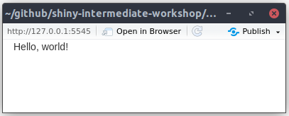
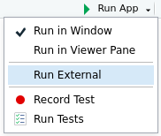
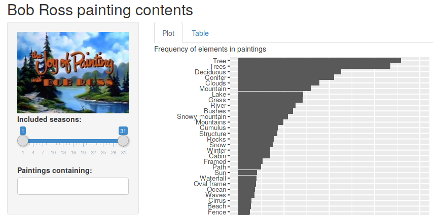
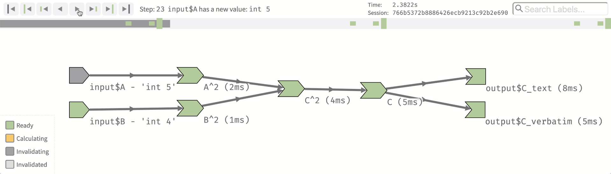

background-image: url("images/title.jpg")
background-size: cover

```{r setup, include=FALSE}
options(htmltools.dir.version = FALSE, width = 120)

library(tidyverse)
library(shiny)
library(countdown)
library(fontawesome)

theme_set(
  theme_grey(base_size = 16) +
  theme(
    legend.position = "bottom",
    plot.background = element_rect(fill = "transparent"),
    legend.background = element_rect(fill = "transparent")
  )
)
```


```{css, echo=FALSE}
/* custom.css */
.left-code {
  color: #777;
  width: 40%;
  height: 92%;
  float: left;
}
.right-plot {
  width: 58%;
  float: right;
  padding-left: 1%;
}
```

<ul class="hextile clr">
	<li>
    <div>
      <h1>01</h1>
      <p style = "padding-top: 20%; font-size: 1.5em">Intro to Shiny</p>
    </div>
  </li>
  <li>
    
  </li>
  <li></li>
  </li>
  <li>
    <div>
      <p style = "padding-top: 20%; font-size: 1.33em">
      Mitchell O'Hara‑Wild (Nectric)
      </p>
    </div>
  </li>
</ul>

.footnote[
Materials at [workshop.nectric.com.au/shiny-wombat24/](https://workshop.nectric.com.au/shiny-wombat24/)
]

---
class: left-side

.pull-left.center.bg-blond[

.portrait[

]

### Mitchell O'Hara-Wild

### Monash + Nectric

[`r fa("github")` @mitchelloharawild](https://github.com/mitchelloharawild)

[`r fa("linkedin")` @mitchelloharawild](https://www.linkedin.com/in/mitchelloharawild/)

]

.pull-right[
# Welcome, who am I?

- `r emo::ji("mortar_board")` Teaches R data skills at Monash University
- `r emo::ji("bar_chart")` Data consulting and workshops at Nectric
- `r emo::ji("chart_with_upwards_trend")` Specialised in time series analysis
- `r emo::ji("package")` Develops R packages (fable, vitae, etc.)
- 🤖 Makes IoT devices for home automation
- 🐝 Keeps bees, chickens and practices permaculture
]

---
class: iframe-page

<iframe src = "https://workshop.nectric.com.au/shiny-wombat24/", style = "width:100%;height:60vh"></iframe>

.center[
<https://workshop.nectric.com.au/shiny-wombat24/>
]


---
class: bg-yellow feature

# `r emo::ji("target")` Tutorial goals

.box-12.larger[
1.  **Learn the basics** of Shiny applications
1.  Create a simple **user interface** including dashboards
1.  Understand **reactive programming** for Shiny server code
1.  **Publish applications** online with docker and/or [shinyapps.io](https://www.shinyapps.io/)
]

# `r emo::ji("present")` Tutorial apps

```{r, eval = FALSE}
usethis::use_course("https://workshop.nectric.com.au/shiny-wombat24/apps.zip")
```

---
class: bg-yellow feature

# ✅ Expectations

.box-12.larger[
* **Respect** each other
* **Engage** by attempting exercises and asking questions
* **Learn** the basics of shiny!
]

--

# ❓ Questions

.box-12.larger[
* **Interrupt** for relevant questions
* **Wait** for exercises/break for off-topic questions
* **Introduce** yourself with one interest (job, hobby, anything!)
* **Ask** with your microphone, or use chat if you prefer.
]

---

class: left-side

.pull-left.center.bg-blond[

# What is Shiny?

.sticker-left[]

]

--

.pull-right[
> Shiny is a framework for creating web applications using R code.
>
> [*Mastering Shiny*](https://mastering-shiny.org/)
]

--

.pull-right[
Shiny allows you to:

* Interactively explore data
* Use R code to perform analysis for web users
* Quickly & easily produce sophisticated apps
]

---

# I use shiny to...

1. Rapidly produce useful tools for the web
1. Allow non-programmers to use powerful R packages
1. Produce interactive learning experiences
1. Create dashboards for data management

--

.box-12.bg-blond[
In the eyes of most people, quickly creating a shiny app is magic `r emo::ji("sparkles")``r emo::ji("man_mage")`.
]

---
background-image: url("images/hive_ss.png")
background-size: contain
background-position: top

.box-12.bg-blond.bottom-margin.center[
# Visualise native Australian bee sightings
<https://shiny.mitchelloharawild.com/hive/>
]

---
background-image: url("images/fpp3_ss.png")
background-size: contain
background-position: top

.box-12.bg-blond.bottom-margin.center[
# Teach statistical concepts
<https://otexts.com/fpp3/prediction-intervals.html>
]

---
background-image: url("images/cooee_ss.png")
background-size: contain
background-position: top

.box-12.bg-blond.bottom-margin.center[
# Simplify evaluation of abstract submissions
<https://github.com/useR-2018/cooee>
]

---
background-image: url("images/taipan_ss.png")
background-size: cover

.sticker-float[]

.box-12.bg-blond.bottom-margin.center[
# Train & validate machine learning models
<https://srkobakian.github.io/taipan/>
]


---
background-image: url("images/whyhive_ss.png")
background-size: contain
background-position: top

.box-12.bg-blond.bottom-margin.center[
# Rapidly prototype data analysis products
<https://www.whyhive.com/>
]


---
background-image: url("images/wpd_ss.png")
background-size: cover

.box-12.bg-blond.bottom-margin.center[
# Provide self-service exploration of data
<https://shiny.nectric.com.au/wpd-app/>
]

---

# Basic components of a shiny app

```r
library(shiny)
ui <- fluidPage(
  "Hello, world!"
)
server <- function(input, output, session) {
  # Nothing to see here!
  # All this app does is say "Hello, world!"
}
shinyApp(ui, server)
```

--

The simplest app consists of a **UI** and **server**, in a single file: `app.R`.

- The UI controls the layout, style and interactivity (HTML, CSS, JS)
- The server controls the behaviour (R)

--

The glue that holds it together is JavaScript and WebSockets.

Shiny allows you to do everything with **only** R code!

---
class: feature

# `r emo::ji("shooting_star")` Your turn!

.box-12[

## Starter shiny app `r emo::ji("mag")`

Run the 'Hello World!' app using code from the previous slide.

1. Copy the code into a new `app.R` file
1. Launch the app using the **Run App** button 
1. Close the app using the stop button `r emo::ji("stop_sign")`

]

```{r, echo = FALSE}
countdown(minutes = 1L)
```


---
class: center

# Where does this app live?

```r
runApp('hello/hello_world')

#> Listening on http://127.0.0.1:5545
```


--

## `r emo::ji("computer")` On the web? `r emo::ji("globe_with_meridians")`

Well, sort of! When running an app locally, your computer serves the app at a local address (`127.0.0.1` or `localhost`).

More on this in session 3!

---
class: center

# View the app in a web browser



When an app is ran locally, it is only accessible to you.

Deploying the app on a server allows others access the app without R.

---

# Adding inputs to the UI

Inputs allow users to provide information to control the app.

**UI**: All **inputs** functions follow a similar signature:

```{r}
textInput(
  inputId = "input_user_text", # ID to obtain text in server code
  label = "Display label", # Guide the user with what to input
  value = "Default text" # Initial value in the box
)
```

**Server**: The provided text for this box is accessible in the server code with:

```{r, eval = FALSE}
input$input_user_text # The provided inputId
```

<div class="remark-code-line"><code id="output_server_text" class="remark-code remark-inline-code">## [1] "Default text"</code></div>

---

# Adding outputs to the UI

Outputs return information from the server to the interface.

**UI**: All **output** functions also have similar arguments:

```{r}
textOutput(
  outputId = "output_server_text", # ID used by server code
)
```
My text from the server!

**Server**: The server provides output to the UI using **render** functions:

```{r, eval = FALSE}
output$output_server_text <- renderText({
  "My text from the server!"
  # You could use any R code here, perhaps even inputs like input$input_user_text
})
```

---
class: feature

# `r emo::ji("shooting_star")` Your turn!

.box-12[

## Hello you!

Extend the `hello/hello_world` app to greet the user's name, rather than 'world'.

1. Add a text input field to provide the user's name.
1. Replace the static 'Hello World!' text with a text output.
1. Add a text renderer to the server, which creates the output 'Hello {{name}}!'

If you have time, modify the app to say 'Good morning', 'Good afternoon' and 'Good night' based on `Sys.time()`

]

```{r, echo = FALSE}
countdown(minutes = 3L)
```

---

# `r emo::ji("flag_in_hole")` Possible solution

```{r, eval = FALSE}
library(shiny)
ui <- fluidPage(
  textInput("name", "Enter your name: "),
  textOutput("greeting")
)
server <- function(input, output, session) {
  output$greeting <- renderText({
    sprintf("Hello %s!", input$name)
  })
}
shinyApp(ui, server)
```

--

### Bonus:
```{r, eval = FALSE}
output$greeting <- renderText({
  hour <- lubridate::hour(Sys.time())
  time <- if (dplyr::between(hour, 6, 11)) "morning" else
          if (dplyr::between(hour, 12, 18)) "afternoon" else "night"
  sprintf("Good %s %s!", time, input$name)
})
```


---
background-image: url("images/cheatsheet.png")
background-size: contain
background-position: top

.box-12.bg-blond.bottom-margin.center[
# `r emo::ji("book")` Shiny cheatsheet `r emo::ji("book")`
# (Inputs and outputs galore)
https://rstudio.github.io/cheatsheets/shiny.pdf
]

---

# A multi-file shiny app

```{r}
fs::dir_tree("../apps/bob_ross/01_bob_ross")
```

--

Most shiny apps are organised into several files.

* `ui.R`: The specification of the user interface
* `server.R`: The R code to define behaviour
* `global.R`: Objects creation accessible to both `ui.R` and `server.R`
* `data/`: Folder for your data
* `www/`: Folder for your web data (images, css, javascript, etc.)

---
background-image: url("images/bob_ross.png")
background-size: contain
background-position: top

.box-12.bg-blond.bottom-margin.center[
# `r emo::ji("art")` A happy little app `r emo::ji("art")`
A shiny app for FiveThirtyEight's [*Statistical Analysis of the Work of Bob Ross*](https://fivethirtyeight.com/features/a-statistical-analysis-of-the-work-of-bob-ross/)

Try the app for yourself, you can find it in "bob_ross/01_bob_ross".
]

---

# `r emo::ji("globe")` `global.R`: Global objects
```{r, eval = FALSE}
library(tidyverse)

# Tidy the data
elements <- read_csv("data/elements-by-episode.csv") %>% 
  separate(EPISODE, c("season", "episode"), sep = c(3,6)) %>% 
  pivot_longer(cols = c(-season, -episode, -TITLE), names_to = "element", values_to = "exists") %>% 
  mutate(
    season = parse_number(season),
    episode = parse_number(episode),
    element = str_to_sentence(str_replace_all(element, "_", " ")),
    TITLE = str_to_sentence(TITLE),
    exists = as.logical(exists)
  ) %>% 
  rename(title = TITLE)
```

---

# `r emo::ji("art")` `ui.R`: Understanding the UI

```{r, eval = FALSE}
library(shiny)
fluidPage(
  titlePanel("Bob Ross painting contents"),
  sidebarLayout(
    sidebarPanel(
      # Joy of painting title image
      img(src = "joy_of_painting.jpg", width = "100%"),
      # Season selector
      sliderInput(inputId = "seasons",
                  label = "Included seasons:",
                  min = min(elements$season),
                  max = max(elements$season),
                  value = range(elements$season))
    ),
    mainPanel(
      # Plot output
      "Frequency of elements in paintings",
      plotOutput(outputId = "plot_proportion", height = "800px"),
      # Table output
      "Top 10 most common elements",
      tableOutput(outputId = "data_proportion")
    )
  )
)
```

---

# `r emo::ji("art")` `ui.R`: A two-panel sidebar layout

```{r, eval = FALSE}
library(shiny)
fluidPage(
  titlePanel("Bob Ross painting contents"),
  sidebarLayout( #<<
    sidebarPanel( #<<
      # Joy of painting title image
      img(src = "joy_of_painting.jpg", width = "100%"),
      # Season selector
      sliderInput(inputId = "seasons",
                  label = "Included seasons:",
                  min = min(elements$season),
                  max = max(elements$season),
                  value = range(elements$season))
    ), #<<
    mainPanel( #<<
      # Plot output
      "Frequency of elements in paintings",
      plotOutput(outputId = "plot_proportion", height = "800px"),
      # Table output
      "Top 10 most common elements",
      tableOutput(outputId = "data_proportion")
    ) #<<
  ) #<<
)
```

---

# `r emo::ji("art")` `ui.R`: Add an image from `www` folder

```{r, eval = FALSE}
library(shiny)
fluidPage(
  titlePanel("Bob Ross painting contents"),
  sidebarLayout(
    sidebarPanel(
      # Joy of painting title image #<<
      img(src = "joy_of_painting.jpg", width = "100%"), #<<
      # Season selector
      sliderInput(inputId = "seasons",
                  label = "Included seasons:",
                  min = min(elements$season),
                  max = max(elements$season),
                  value = range(elements$season))
    ), 
    mainPanel(
      # Plot output
      "Frequency of elements in paintings",
      plotOutput(outputId = "plot_proportion", height = "800px"),
      # Table output
      "Top 10 most common elements",
      tableOutput(outputId = "data_proportion")
    ) 
  )
)
```


---

# `r emo::ji("art")` `ui.R`: Add the season slider

```{r, eval = FALSE}
library(shiny)
fluidPage(
  titlePanel("Bob Ross painting contents"),
  sidebarLayout(
    sidebarPanel(
      # Joy of painting title image
      img(src = "joy_of_painting.jpg", width = "100%"),
      # Season selector #<<
      sliderInput(inputId = "seasons", #<<
                  label = "Included seasons:", #<<
                  min = min(elements$season), #<<
                  max = max(elements$season), #<<
                  value = range(elements$season)) #<<
    ), 
    mainPanel(
      # Plot output
      "Frequency of elements in paintings",
      plotOutput(outputId = "plot_proportion", height = "800px"),
      # Table output
      "Top 10 most common elements",
      tableOutput(outputId = "data_proportion")
    ) 
  )
)
```


---

# `r emo::ji("art")` `ui.R`: Add outputs to the main panel

```{r, eval = FALSE}
library(shiny)
fluidPage(
  titlePanel("Bob Ross painting contents"),
  sidebarLayout(
    sidebarPanel(
      # Joy of painting title image
      img(src = "joy_of_painting.jpg", width = "100%"),
      # Season selector
      sliderInput(inputId = "seasons",
                  label = "Included seasons:",
                  min = min(elements$season),
                  max = max(elements$season),
                  value = range(elements$season))
    ), 
    mainPanel(
      # Plot output #<<
      "Frequency of elements in paintings", #<<
      plotOutput(outputId = "plot_proportion", height = "800px"), #<<
      # Table output #<<
      "Top 10 most common elements", #<<
      tableOutput(outputId = "data_proportion") #<<
    ) 
  )
)
```

---

# `r emo::ji("computer")` `server.R`: Creating interactive behaviour

```{r}
library(shiny)
library(dplyr)
function(input, output, session) {
  output$plot_proportion <- renderPlot({
    elements_prop <- elements %>% 
      filter(between(season, input$seasons[1], input$seasons[2])) %>% 
      group_by(element) %>% 
      summarise(proportion = mean(exists)) %>% 
      arrange(desc(proportion)) %>% 
      mutate(element = fct_reorder(element, proportion))
    elements_prop %>% 
      ggplot(aes(x = proportion, y = element)) + 
      geom_col() +
      scale_x_continuous(labels = scales::percent, limits = c(0,1))
  })
  output$data_proportion <- renderTable({
    elements %>% 
      filter(between(season, input$seasons[1], input$seasons[2])) %>% 
      group_by(element) %>% 
      summarise(proportion = mean(exists)) %>% 
      arrange(desc(proportion)) %>% 
      mutate(element = fct_reorder(element, proportion)) %>% 
      top_n(10, proportion)
  })
}
```

---

# `r emo::ji("computer")` `server.R`: Render to an output

```{r}
library(shiny)
library(dplyr)
function(input, output, session) {
  output$plot_proportion <- renderPlot({ #<<
    elements_prop <- elements %>% 
      filter(between(season, input$seasons[1], input$seasons[2])) %>% 
      group_by(element) %>% 
      summarise(proportion = mean(exists)) %>% 
      arrange(desc(proportion)) %>% 
      mutate(element = fct_reorder(element, proportion))
    elements_prop %>% 
      ggplot(aes(x = proportion, y = element)) + 
      geom_col() +
      scale_x_continuous(labels = scales::percent, limits = c(0,1))
  })
  output$data_proportion <- renderTable({ #<<
    elements %>% 
      filter(between(season, input$seasons[1], input$seasons[2])) %>% 
      group_by(element) %>% 
      summarise(proportion = mean(exists)) %>% 
      arrange(desc(proportion)) %>% 
      mutate(element = fct_reorder(element, proportion)) %>% 
      top_n(10, proportion)
  })
}
```

---

# `r emo::ji("computer")` `server.R`: Filter based on slider inputs

```{r}
library(shiny)
library(dplyr)
function(input, output, session) {
  output$plot_proportion <- renderPlot({
    elements_prop <- elements %>% #<<
      filter(between(season, input$seasons[1], input$seasons[2])) %>% #<<
      group_by(element) %>% 
      summarise(proportion = mean(exists)) %>% 
      arrange(desc(proportion)) %>% 
      mutate(element = fct_reorder(element, proportion))
    elements_prop %>% 
      ggplot(aes(x = proportion, y = element)) + 
      geom_col() +
      scale_x_continuous(labels = scales::percent, limits = c(0,1))
  })
  output$data_proportion <- renderTable({
    elements %>% #<<
      filter(between(season, input$seasons[1], input$seasons[2])) %>% #<<
      group_by(element) %>% 
      summarise(proportion = mean(exists)) %>% 
      arrange(desc(proportion)) %>% 
      mutate(element = fct_reorder(element, proportion)) %>% 
      top_n(10, proportion)
  })
}
```

---

# `r emo::ji("computer")` `server.R`: Compute and order by proportion

```{r}
library(shiny)
library(dplyr)
function(input, output, session) {
  output$plot_proportion <- renderPlot({
    elements_prop <- elements %>% 
      filter(between(season, input$seasons[1], input$seasons[2])) %>% 
      group_by(element) %>%  #<<
      summarise(proportion = mean(exists)) %>%  #<<
      arrange(desc(proportion)) %>%  #<<
      mutate(element = fct_reorder(element, proportion)) #<<
    elements_prop %>% 
      ggplot(aes(x = proportion, y = element)) + 
      geom_col() +
      scale_x_continuous(labels = scales::percent, limits = c(0,1))
  })
  output$data_proportion <- renderTable({
    elements %>% 
      filter(between(season, input$seasons[1], input$seasons[2])) %>% 
      group_by(element) %>%  #<<
      summarise(proportion = mean(exists)) %>% #<<
      arrange(desc(proportion)) %>%  #<<
      mutate(element = fct_reorder(element, proportion)) %>% #<<
      top_n(10, proportion)
  })
}
```

---

# `r emo::ji("computer")` `server.R`: Create the output

```{r}
library(shiny)
library(dplyr)
function(input, output, session) {
  output$plot_proportion <- renderPlot({ 
    elements_prop <- elements %>% 
      filter(between(season, input$seasons[1], input$seasons[2])) %>% 
      group_by(element) %>% 
      summarise(proportion = mean(exists)) %>% 
      arrange(desc(proportion)) %>% 
      mutate(element = fct_reorder(element, proportion))
    elements_prop %>% #<<
      ggplot(aes(x = proportion, y = element)) + #<<
      geom_col() +#<<
      scale_x_continuous(labels = scales::percent, limits = c(0,1))#<<
  })
  output$data_proportion <- renderTable({ 
    elements %>% 
      filter(between(season, input$seasons[1], input$seasons[2])) %>% 
      group_by(element) %>% 
      summarise(proportion = mean(exists)) %>% 
      arrange(desc(proportion)) %>% 
      mutate(element = fct_reorder(element, proportion)) %>% 
      top_n(10, proportion) #<<
  })
}
```

---
class: center

.box-12.bg-blond[
# `r emo::ji("construction")` This app has room for improvement! `r emo::ji("construction")`
]

# How could we make it better?

--

Remove code duplication

--

Add comments to server code

--

Make it more useful

--

Improve layout of outputs

--

Make it look better

---
class: center

.box-12.bg-blond[
# `r emo::ji("construction")` This app has room for improvement! `r emo::ji("construction")`
]

# How could we make it better?


Remove code duplication


Add comments to server code


**Make it more useful**


**Improve layout of outputs**


Make it look better

---

# `r emo::ji("bar_chart")` Improving the layout of outputs with tabs

```{r, eval = FALSE}
tabsetPanel( 
  tabPanel("Plot", 
    "Frequency of elements in paintings",
    plotOutput("plot_proportion", height = "800px")
  ), 
  tabPanel("Table", 
    # Table output
    "Top 10 most common elements",
    tableOutput("data_proportion")
  )
)
```

.center[

]

---
class: feature

# `r emo::ji("shooting_star")` Your turn!

.box-12[
## Make the app more useful! `r emo::ji("man_artist")` `r emo::ji("woman_artist")`
.center[

]
]


---
class: feature

# `r emo::ji("shooting_star")` Your turn!

.box-12[
## Make the app more useful! `r emo::ji("man_artist")` `r emo::ji("woman_artist")`

Modify the `bob_ross/01_bob_ross` app to support a new feature.

Add a selectize input (`selectizeInput()`) to filter paintings which contain specific elements.

The output plot and table should show element frequency of paintings which:
* Are in the selected season(s)
* Contain the selected elements

Finished early? The plot and table still show elements used in the filter - this is a bit odd since they are guaranteed to be in 100% of the paintings. 

Improve the app by removing these unnecessary observations.

]

```{r, echo = FALSE}
countdown(minutes = 5L)
```

---

# `r emo::ji("flag_in_hole")` Possible solution

### `ui.R`

```{r, eval = FALSE}
# Element selector
selectizeInput("elements",
               "Paintings containing:",
               choices = unique(elements$element),
               multiple = TRUE)
```

--

### `server.R`

```{r, eval = FALSE}
elements %>% 
  group_by(season, episode) %>% #<<
  filter(all(input$elements %in% element[exists])) %>% #<<
  filter(between(season, input$seasons[1], input$seasons[2])) %>% 
  ...
```

---

# `r emo::ji("flag_in_hole")` Possible solution (bonus)

### `ui.R`

```{r, eval = FALSE}
# Element selector
selectizeInput("elements",
               "Paintings containing:",
               choices = unique(elements$element),
               multiple = TRUE)
```

### `server.R`

```{r, eval = FALSE}
elements %>% 
  group_by(season, episode) %>% 
  filter(all(input$elements %in% element[exists])) %>%
  filter(between(season, input$seasons[1], input$seasons[2])) %>% 
  filter(!(element %in% input$elements)) %>% #<<
  ...
```

---

# `r emo::ji("robot")` Advanced UI design

The `ui` of a shiny app simply creates HTML with special shiny tags.

```{r}
sliderInput(inputId = "seasons", label = "Included seasons:",
            min = 1L, max = 30L, value = c(1L, 30L))
```

```html
<div class="form-group shiny-input-container">
  <label class="control-label" id="seasons-label" for="seasons">Included seasons:</label>
  <input class="js-range-slider" id="seasons" data-skin="shiny" data-type="double" data-min="1" data-max="30" data-from="1" data-to="30" data-step="0.5" data-grid="true" data-grid-num="9.66666666666667" data-grid-snap="false" data-prettify-separator="," data-prettify-enabled="true" data-keyboard="true" data-drag-interval="true" data-data-type="number"/>
</div>
```

--

You can add these shiny inputs to the HTML of any webpage.

This allows your shiny app to seamlessly match the style of your existing website, or team up with web designers and create beautiful apps.


---

# `r emo::ji("robot")` Advanced UI design

The `ui` of a shiny app simply creates HTML with special shiny tags.

```{r}
plotOutput("plot_proportion", height = "200px")
```

```html
<div class="shiny-plot-output html-fill-item" id="plot_proportion" style="width:100%;height:200px;"></div>
```

You can also add shiny outputs to the HTML of any webpage.

---
class: feature

# `r emo::ji("clock1030")` Break time!

.box-12[
## Next topic: reactivity `r emo::ji("boom")`

Time for a break! Take some time to practice shiny by making an app or modifying the examples shown. Ask questions, or just relax and ready yourself to learn about reactive programming!


]

